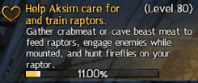

# GW2-TransparentHeartProgress
Public part of Guild Wars 2 addon: Transparent Heart Progress

### Preview


### Functionality
The Transparent Heart Progress addon provides a detailed and visually appealing display of renown heart progression in Guild Wars 2. It enhances the default UI by showing precise progress percentage with precision of two decimal places that integrates seamlessly with the game's interface. This data is already available to all users (graphically, in form of bar only) or to other party members (as hover tooltip) thus making addon ToS compliant.

### Features:
- Displays renown heart progress as a percentage
- Minimalistic, lightweight and easy to use

### Notes
- After enabling the addon you might need to leave and re-enter Renown Heart.

### Build
Addon buildable with [Docker GW2 Addon Builder](https://github.com/jsantorek/GW2-AddonBuilder).
```bash
docker run --rm \
    -v <repo-path>:/addon \
    ghcr.io/jsantorek/gw2-addon-builder:latest \
    bash -c "\
        conan install . --build missing --profile windows-dynamic &&\
        cmake --preset conan-release &&\
        cmake --build --preset conan-release &&\
        cmake --install build/Release --prefix install "
```

### Support
[](https://discord.com/channels/410828272679518241/1371818213863718954)
